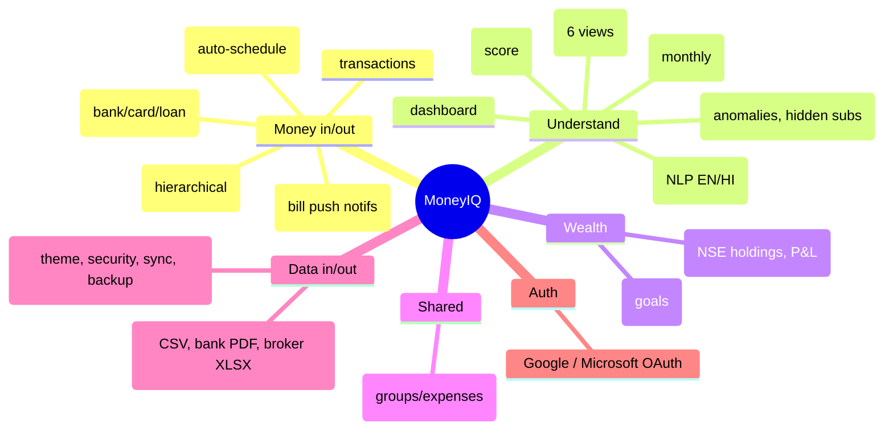
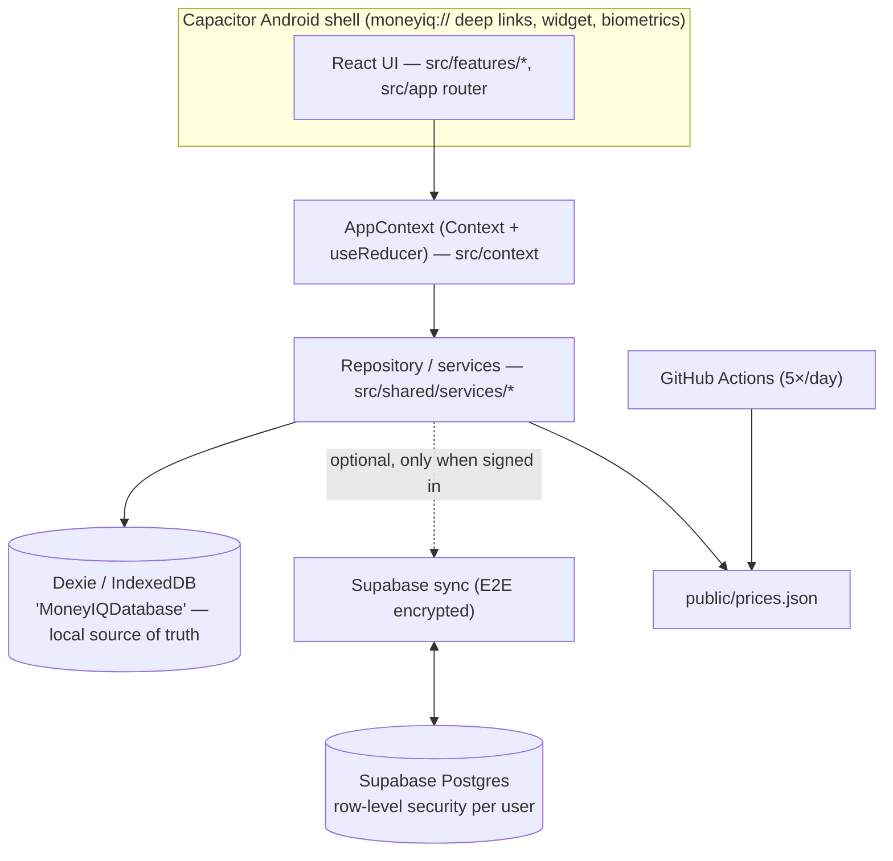
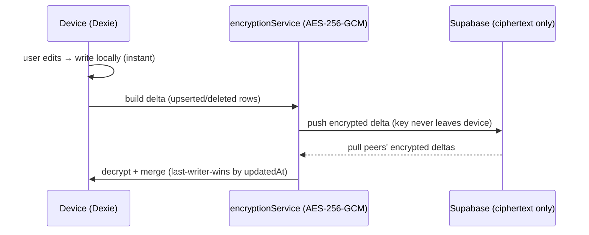

# MoneyIQ — Architecture & Context (agent primer)

> **Read this first.** It gives you the whole app in one compact file so you don't have to scan the
> codebase to get oriented. Diagrams over prose on purpose. Deep-dive into `src/` only when a task needs it.

**Purpose:** A **local-first, private-by-default** personal-finance manager for India. Everything works
offline on-device; optional **end-to-end-encrypted** sync mirrors data across the user's own devices.
No ads, no subscription, no data mining. Shipped as a PWA (GitHub Pages) and an Android app (Capacitor).

**Stack:** React 18 + TypeScript (strict) · Vite · Tailwind · Dexie (IndexedDB) · Capacitor (Android) ·
Supabase (optional sync backend) · Recharts · Vitest. State = React Context + `useReducer`.

## Feature map


## Layered architecture

**Rule of thumb:** UI never touches storage directly → always go through a service in
`src/shared/services/`. Local Dexie is the source of truth; the network is an optional mirror.

## Sync flow (local-first + E2E encrypted)


## Data model (Dexie, all rows scoped by `profileId` for multi-profile)
`transactions` · `accounts` · `categories` · `budgets` · `recurringRules` · `receipts` ·
`stockTransactions` · `billReminders` · `splitGroups`/`splitMembers`/`splitExpenses` · `profiles` ·
`settings` · `customInstitutions` · `migrations`. Compound indexes on `[profileId+updatedAt]` power sync deltas.

## Directory map
```
src/
  app/         # router, shell bootstrap
  context/     # AppContext (global state via useReducer)
  features/    # 18 feature folders (accounts, analytics, assistant, auth, budgets,
               #   categories, dashboard, health, import, insights, recurring,
               #   reminders, reports, savings, settings, splitwise, stocks, transactions)
  shared/
    components/ services/ hooks/ context/ types/ config/ utils/
  test/        # Vitest (encryption, auth, parsers, projections)
```

## Golden rules (do NOT break)
- **Never rename these identifiers** (they map to persisted data / OS integration):
  IndexedDB name `MoneyIQDatabase`, `moneyiq_*` storage keys, the `moneyiq://` deep-link scheme,
  `moneyiq-*` sync/backup filenames. The release keystore alias stays `expenseiq`.
- **Privacy:** financial data is never shared with third parties; cloud rows are E2E encrypted; the
  developer cannot read them. Don't add analytics on financial content.
- **Conventions:** TypeScript strict (no `any`), functional components, Tailwind only, repository
  pattern for data. Tests with Vitest. See `AGENTS.md` + `CONTRIBUTING.md`.
