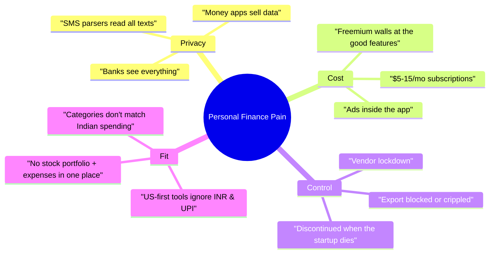
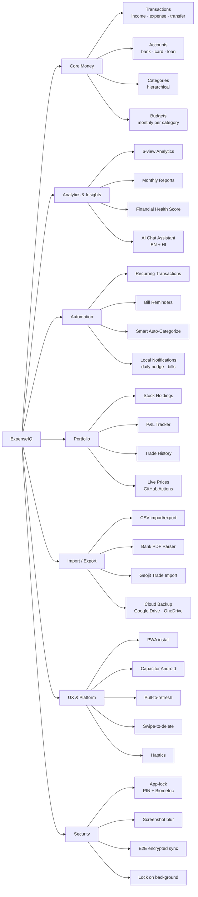
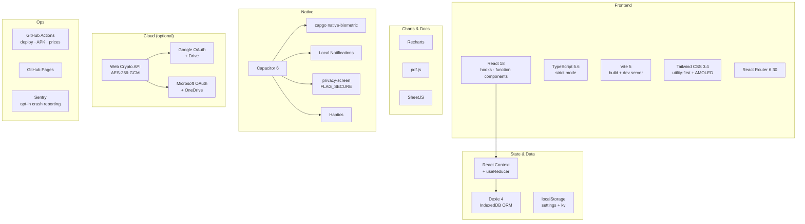
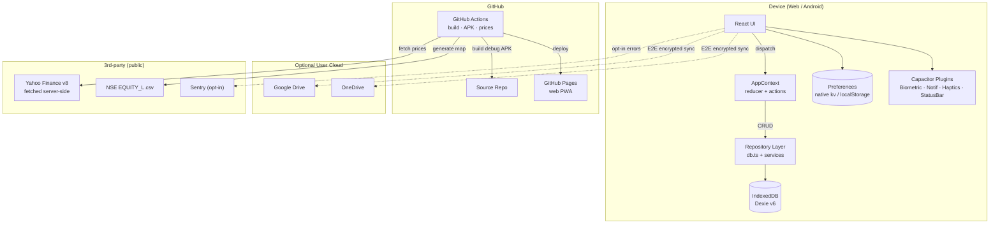
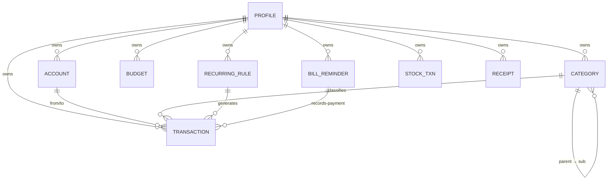
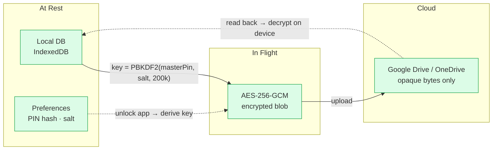
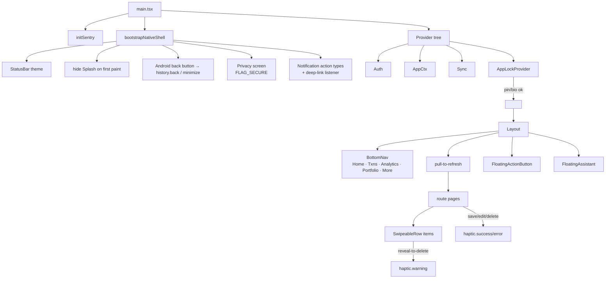
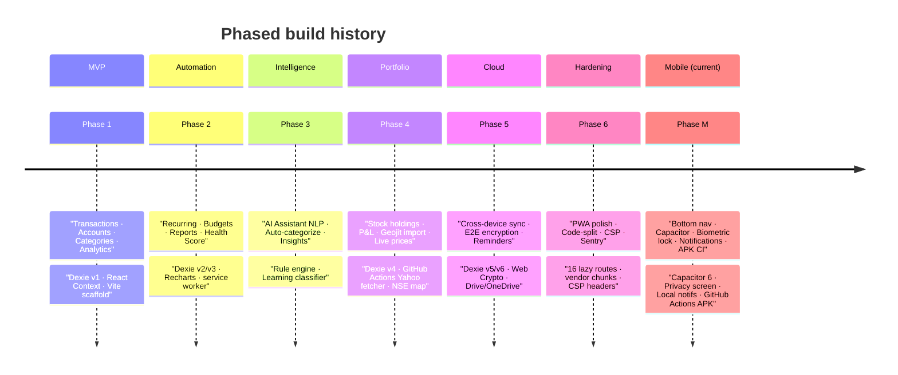
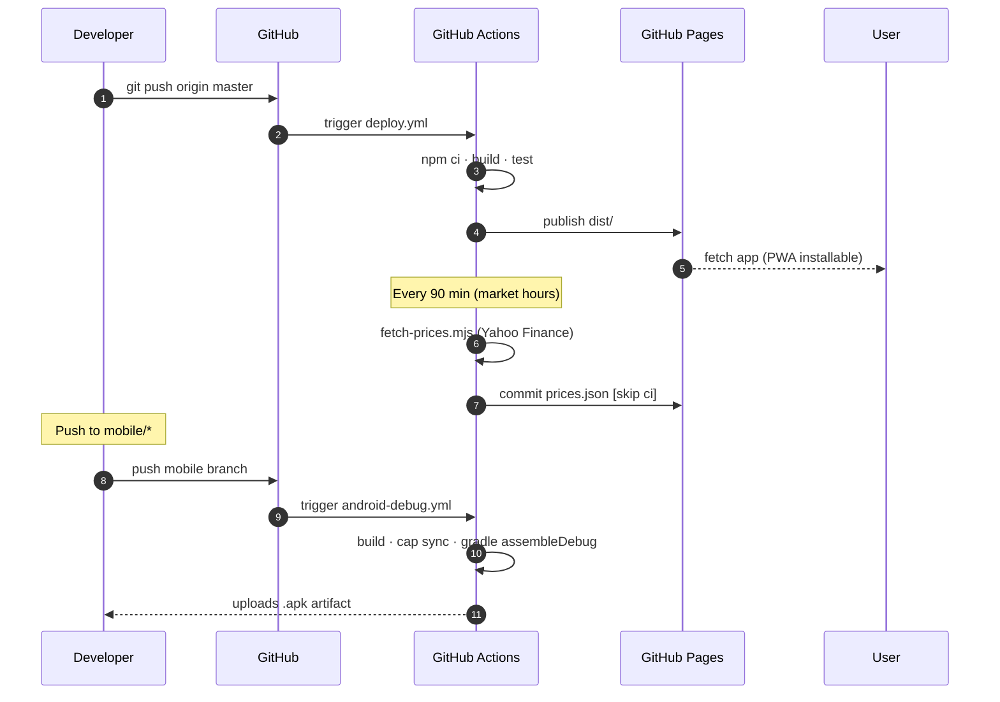
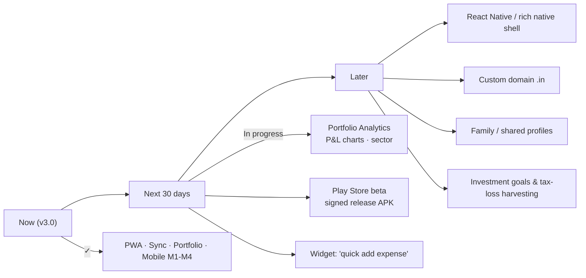

# ExpenseIQ — The Complete Guide

> **Your money, on your terms.** A private-by-default personal-finance app that turns your phone into a full-featured expense manager, portfolio tracker, and financial assistant — with **zero servers**, **zero subscriptions**, and **zero data leaves your device** unless you say so.

---

## 📖 Table of Contents

1. [The Elevator Pitch](#-the-elevator-pitch)
2. [What Problem Does It Solve?](#-what-problem-does-it-solve)
3. [Feature Tour (Functional)](#-feature-tour-functional)
4. [Tech Stack at a Glance](#-tech-stack-at-a-glance)
5. [High-Level Architecture](#-high-level-architecture)
6. [Data Model](#-data-model)
7. [Security & Privacy Model](#-security--privacy-model)
8. [Mobile-First Design](#-mobile-first-design)
9. [How the App Was Built (Journey)](#-how-the-app-was-built-journey)
10. [Deployment & Operations](#-deployment--operations)
11. [Roadmap](#-roadmap)
12. [Talking Points (Cheat Sheet)](#-talking-points-cheat-sheet)

---

## 🎯 The Elevator Pitch

> "ExpenseIQ is a **local-first** personal-finance app that runs entirely in your browser or phone. It tracks expenses, budgets, stock portfolios, and bills — with **biometric-locked**, **end-to-end encrypted** optional sync across your devices. No backend, no ads, no data mining. Install it as a PWA today, get a native Android app tomorrow."

**Three sentences.** That's the pitch.

**Why it wins:**
- **Own your data.** Everything lives in IndexedDB on your device. Cloud sync is opt-in and E2E-encrypted with AES-256-GCM.
- **Works offline, forever.** PWA + Capacitor. No network dependency. No subscription that can be cancelled.
- **Actually smart.** NLP chat assistant (English + Hindi), auto-categorization that learns, live stock prices via GitHub Actions, financial health score.

---

## 🧨 What Problem Does It Solve?



**ExpenseIQ answers each of these directly.** Local-first fixes privacy + control. Free hosting on GitHub Pages fixes cost. Indian-first design (₹ / lakh / crore / UPI / NSE stocks) fixes fit.

---

## 🚀 Feature Tour (Functional)

### The 22 features shipping today



### Standout features explained

| # | Feature | What Makes It Special |
|---|---------|-----------------------|
| 1 | **Local-first DB** | Dexie/IndexedDB — everything works offline. Cloud sync is optional. |
| 2 | **6-view Analytics** | Overview, category, trend, income-vs-expense, budget, period comparison. |
| 3 | **AI Chat Assistant** | Rules-based NLP; answers "how much did I spend on food last month?" in English or Hindi. |
| 4 | **Bill Reminders + Local Notifications** | Fires natively on Android at 9am on the due date. Deep-links back into the app. |
| 5 | **Financial Health Score** | Composite score across savings rate, budget adherence, emergency fund, and debt ratio. |
| 6 | **Bank Statement Parser** | X-coordinate column mapping in pdf.js. Handles password-protected PDFs. |
| 7 | **Stock Portfolio** | Live prices via GitHub Actions → static `prices.json` (zero CORS). Auto-refresh 5×/day IST market hours. |
| 8 | **App-Lock** | PBKDF2-hashed PIN + biometric (Face ID / fingerprint), exponential-backoff on failed attempts. |
| 9 | **E2E Encrypted Cloud Sync** | AES-256-GCM. Google Drive or OneDrive stores an opaque blob; only your device can decrypt it. |
| 10 | **PWA + Native Android** | Same React codebase. One deploy → both surfaces. |

---

## 🧰 Tech Stack at a Glance



**Zero backend servers.** Everything above the line runs on the client. Everything below the line is either free hosting (GitHub Pages, GitHub Actions) or user-owned storage (Drive, OneDrive).

---

## 🏛 High-Level Architecture



### Layered separation

```
┌────────────────────────────────────────────┐
│  UI layer   (features/*/components)        │  ← React screens
├────────────────────────────────────────────┤
│  State     (context/AppContext.tsx)        │  ← reducer + async actions
├────────────────────────────────────────────┤
│  Services  (shared/services/*.ts)          │  ← db · auth · sync · haptics
├────────────────────────────────────────────┤
│  Native    (Capacitor plugins)             │  ← biometric · notif · privacy
├────────────────────────────────────────────┤
│  Storage   (IndexedDB · Preferences)       │  ← Dexie · @capacitor/preferences
└────────────────────────────────────────────┘
```

**Rule:** UI never touches IndexedDB directly. It goes through `actions.*` which go through the repository, which goes through Dexie. Keeps side-effects testable and swappable.

---

## 🗄 Data Model



### Dexie schema evolution (v1 → v6)

| Version | Added | Purpose |
|---|---|---|
| v1 | transactions, categories, accounts, settings | MVP |
| v2 | recurringRules | Auto-generated income/expense |
| v3 | receipts | Photo-attached expenses |
| v4 | stockTransactions | Portfolio tracking |
| v5 | billReminders | Push-notification bills |
| v6 | `updatedAt` compound indexes | Delta sync (fast cloud pulls) |

Runtime migration `v2` also fixes broker-imported stock symbols using the **official NSE EQUITY_L.csv** (2,130+ stocks) — no guesswork.

---

## 🔐 Security & Privacy Model



### Key security controls

| Control | Implementation | Why It Matters |
|---|---|---|
| **App-lock PIN** | 6-digit PIN, PBKDF2-HMAC-SHA256, 200k iterations, 16-byte per-install salt, constant-time compare | Even a full device dump can't recover the PIN |
| **Biometric** | `@capgo/capacitor-native-biometric` (Face ID / Touch ID / fingerprint) | Fast + strong; OS holds the credential |
| **Screenshot blur** | `@capacitor-community/privacy-screen` → Android `FLAG_SECURE` | Hides balances in the recent-apps switcher |
| **Lock on background** | `App.appStateChange` listener + idle timeout (default 60s) | Prevents shoulder-surfing after handing over the phone |
| **E2E encrypted sync** | AES-256-GCM, key derived from user passphrase, never leaves device | Cloud provider sees only opaque bytes |
| **CSP + DOMPurify** | Strict Content-Security-Policy, XSS-sanitized rich text | Defense-in-depth against injected scripts |
| **Sentry PII scrub** | `beforeSend` strips email, IP, URL queries, `ui.input` breadcrumbs | Crash telemetry cannot leak financial data |

### Threat model (short version)

| Threat | Mitigation |
|---|---|
| Lost phone | App-lock + screenshot blur + FLAG_SECURE |
| Malicious app on device | Preferences storage isolated; PIN never in cleartext |
| Compromised cloud provider | E2E encryption; provider holds ciphertext only |
| Stolen backup file | Requires master passphrase to decrypt |
| Man-in-the-middle | HTTPS-only + no plaintext sync payloads |
| Copy-paste of screenshot | FLAG_SECURE + blur on background |

---

## 📱 Mobile-First Design

### The mobile bundle (Phase M.1 → M.4)



### Native features wired

| Feature | Plugin | Where |
|---|---|---|
| Bottom nav (5 tabs) | — | `BottomNav.tsx` |
| Bottom sheets | — | `Modal` full-screen on mobile |
| Pull-to-refresh | custom hook | `usePullToRefresh.ts` |
| Swipe-to-delete | custom | `SwipeableRow.tsx` |
| Haptics | `@capacitor/haptics` | `haptics.ts` wrapper w/ kill-switch |
| Biometric | `@capgo/capacitor-native-biometric` | `appLockService.ts` |
| Screenshot blur | `@capacitor-community/privacy-screen` | `nativeShell.ts` |
| Local notifications | `@capacitor/local-notifications` | `notificationService.ts` |
| Status bar theme | `@capacitor/status-bar` | `nativeShell.ts` |
| Splash | `@capacitor/splash-screen` | `nativeShell.ts` |
| App lifecycle | `@capacitor/app` | Lock re-arm + back button |
| Prefs | `@capacitor/preferences` | `preferences.ts` |

---

## 🛠 How the App Was Built (Journey)



### Development philosophy

1. **Ship the smallest thing that works, then iterate.** Each phase adds 4–6 features, no more.
2. **Test the interesting bits, not everything.** Encryption + auth are unit-tested; UI is behavior-tested.
3. **Own the infra.** No paid SaaS in the critical path. GitHub Actions + GitHub Pages + user's own cloud storage.
4. **Local-first, always.** If it needs a server to work, it doesn't ship.
5. **Feature-based folders.** `src/features/transactions/`, `src/features/portfolio/` — related code stays together.

### Repo layout

```
expense-manager/
├── src/
│   ├── features/          # feature modules (transactions, portfolio, budgets…)
│   ├── shared/            # cross-cutting UI, services, hooks
│   ├── context/           # React providers (App, Auth, Sync, AppLock)
│   ├── app/router.tsx     # route table
│   └── main.tsx           # bootstrap
├── public/                # icons · manifest · prices.json · nse-symbol-map.json
├── scripts/               # fetch-prices.mjs · generate-nse-map.mjs
├── capacitor.config.ts    # native shell config
└── .github/workflows/     # deploy · update-prices · android-debug
```

---

## 🚢 Deployment & Operations



### Three workflows

| Workflow | Trigger | Output |
|---|---|---|
| `deploy.yml` | push to master | Web PWA on GitHub Pages |
| `update-prices.yml` | cron (5× IST market hours) | Static `prices.json` (no runtime CORS) |
| `android-debug.yml` | push to `mobile/*` or manual | Debug `.apk` artifact for local install |

**Cost:** ₹0. Everything runs on GitHub's free tier for public repos.

---

## 🗺 Roadmap



---

## 🎤 Talking Points (Cheat Sheet)

Print this section, memorize the bullets, and you can talk about the app fluently in any interview or demo.

### If someone asks "What's ExpenseIQ?"
> "It's a **local-first personal-finance PWA** built in React + TypeScript. Your data stays on your device in IndexedDB. Cloud sync is optional and E2E-encrypted. I built it to escape ₹5000/year subscriptions that harvest your bank data."

### If they ask about the **tech stack**
> "React 18 + TypeScript strict, Vite for the build, Tailwind for styling, Dexie for IndexedDB, Recharts for viz. Native shell is Capacitor 6 with biometric, haptics, local notifications, and screenshot blur. Deploys via GitHub Actions to GitHub Pages — zero paid infra."

### If they ask about **architecture**
> "Four layers: React UI → AppContext (reducer + async actions) → Repository → Dexie/IndexedDB. Feature-based folder structure. Cross-platform primitives (`platform.ts`, `preferences.ts`, `haptics.ts`) so the same code runs on web and native."

### If they ask about **security**
> "PIN is PBKDF2-HMAC-SHA256, 200k iterations, 16-byte per-install salt, constant-time compare. Biometric via native APIs — OS holds the credential, we never see it. Cloud sync is AES-256-GCM with a key derived from the user's passphrase. Screenshot blur via Android FLAG_SECURE."

### If they ask about **scale**
> "Fully client-side, so scale is per-device. Bundle is split into 16 lazy routes + 6 vendor chunks, gzipped to ~450 KB initial payload. Dexie handles tens of thousands of rows locally with sub-100 ms query times."

### If they ask about **testing**
> "Vitest + React Testing Library. Focused unit tests on the interesting logic — encryption, auth, PIN verification. UI is tested for behavior when it matters, not coverage-chased."

### If they ask **"why not a real backend?"**
> "Because the moment you add a backend, you have to run it, pay for it, secure it, keep it up when the startup dies. Local-first + user-owned cloud storage means the app outlives me. The user's data is on their device and in their Drive — I'm not a dependency."

### If they ask **"how did you learn all this?"**
> "By doing it. Every phase — MVP → recurring → intelligence → portfolio → cloud → mobile — was a new problem I solved end-to-end: pick the library, understand the plugin API, ship it, harden it, document it in `DEVELOPMENT.md`. Learning-by-shipping."

---

## 📚 Further Reading (Internal Docs)

| Doc | What's in it |
|---|---|
| `DEVELOPMENT.md` | Every command you need to build, test, run web + mobile locally. Troubleshooting for 20+ common issues. |
| `README.md` | Public-facing intro (feature list + live URL) |
| `capacitor.config.ts` | Native shell config |
| `.github/workflows/*` | CI: web deploy, price fetcher, Android APK builder |
| `src/shared/services/*` | The service layer — where the interesting logic lives |

---

*Last updated: 2026-07-24. Version 3.0. Built with ❤ locally, deployed for ₹0.*
