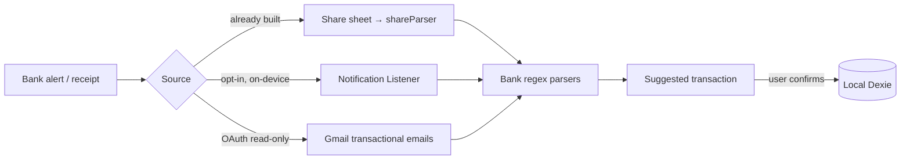

# Design: Salary Intelligence, Auto-Detect & Net Worth

Status doc for the Salary/Tax/Auto-detect epic. Aligns with MoneyIQ's **local-first, privacy-first**
architecture: everything parses and computes **on-device**; nothing sensitive leaves the phone.

See also: `ARCHITECTURE.md` (app overview), `PLAY_STORE_PUBLISHING.md` (release), `AGENTS.md`.

---

## Milestone A — Salary Intelligence  ✅ shipped (v1)

**Goal:** help users understand their pay — CTC vs in-hand, deduction breakdown.

- **Data model** (`src/shared/types`): `SalaryProfile` (one per profile: employer, payDay, monthly
  `SalaryComponent[]`), `Payslip` (per-month history snapshot).
- **Storage:** Dexie **v9** — `salaryProfiles` (keyed by `profileId`) + `payslips`. No breaking change
  to existing stores; additive migration.
- **Hook:** `useSalaryProfile` (self-contained, mirrors `useSavingsGoals`) + `computeSalaryTotals`.
- **UI:** `features/salary/SalaryPage` — manual breakdown editor (earnings/deductions), headline
  net-in-hand, gross/deductions/annual cards, in-hand vs deductions bar. Reachable from More + sidebar.

**A.2 (next): Payslip PDF import.** Reuse `pdfStatementParser` (already handles password PDFs) →
`payslipParser` that extracts Basic/HRA/PF/PT/TDS/Net by label regex → pre-fills the editor for the
user to confirm. Store a `Payslip` per month → YTD earnings, PF corpus, month-over-month trend.
Security: parse **on-device only**, discard the file after parsing.

---

## Milestone B — Tax Regime Advisor (Old vs New) + 80C

**Goal:** compute FY tax under both regimes, recommend the cheaper, show the ₹ delta.

- **Engine:** `taxEngine` (pure local) with **config-driven slabs** (`taxConfig.ts`, per FY) so rates
  update without code changes. Inputs = salary (from A) + declared deductions.
- **Deductions modeled:** standard deduction, 80C (PF/ELSS/insurance/PPF), 80D, HRA exemption, home-loan interest, NPS 80CCD(1B).
- **UI:** side-by-side old vs new, recommendation, "you save ₹X", and an 80C progress tracker (₹1.5L cap).
- **Security:** 100% on-device math. Prominent **"estimate, not tax advice"** disclaimer.

---

## Milestone C — Auto-detect expenses (opt-in, privacy-first)

> **Platform reality:** Google Play restricts `READ_SMS` to a few use cases; personal-finance
> transaction reading is **not eligible** → a raw SMS reader will be rejected. We use compliant paths.

| Sub-feature | Play-safe | Mechanism | Notes |
|---|---|---|---|
| **C.1 Share intent** (enhance existing) | ✅ | `SEND` intent → `shareParser` | Already partially built; add more bank templates + a review screen |
| **C.2 Notification Listener** | ✅ w/ prominent consent | `NotificationListenerService` (Capacitor plugin) → parse bank txn notifications on-device | Requires special "notification access" toggle; strongest privacy fit |
| **C.3 Gmail read-only** | ✅ w/ OAuth consent | Gmail API `readonly` scope → fetch txn emails → parse | Reuse Google OAuth; parse card statements/e-receipts |

**Design principles (all sub-features):**
1. **Explicit opt-in** screen per source; off by default; easy off switch in Settings.
2. **On-device parsing only** — raw message text is never stored or uploaded.
3. Emit **suggested** transactions the user **reviews & confirms** — never silent auto-add.
4. Per-bank regex parser registry (extensible, testable with Vitest).
5. Declare each source in the **privacy policy + Play Data safety** form.

**Parser architecture:** `autoDetect/parsers/*` (one module per bank/pattern) → normalized
`DetectedTxn { amount, direction, merchant, account, date, rawRef }` → suggestion queue.

---

## Milestone D — Net Worth & wealth trackers

- **D.1 Net-worth dashboard:** aggregate assets (bank + cash + stocks + PF/PPF) − liabilities
  (loans + credit-card balances). ~70% of data already exists (accounts + stocks).
- **D.2 EPF/PPF/NPS trackers:** manual/imported balances feeding net worth + tax (B).
- **D.3 Take-home / offer comparison:** CTC → in-hand calculator; compare two offers.
- **D.4 Subscription auto-detection:** extend the existing "hidden subscriptions" insight.

---

## Phased delivery
1. **A.1 Salary breakdown** ✅ → 2. **A.2 Payslip import** → 3. **B Tax advisor + 80C** →
4. **C.1 Share + C.2 Notification listener** → 5. **C.3 Gmail** → 6. **D Net worth + EPF/PPF**.

## Security & privacy checklist (every milestone)
- On-device parse/compute; no raw financial text uploaded.
- Opt-in per data source; clear disclosure + revocation.
- Update `PRIVACY_POLICY`, `public/privacy-policy.html`, and Play **Data safety** whenever a new
  source is added.
- Sensitive numbers stored in the encrypted local DB; cloud sync stays E2E-encrypted.
