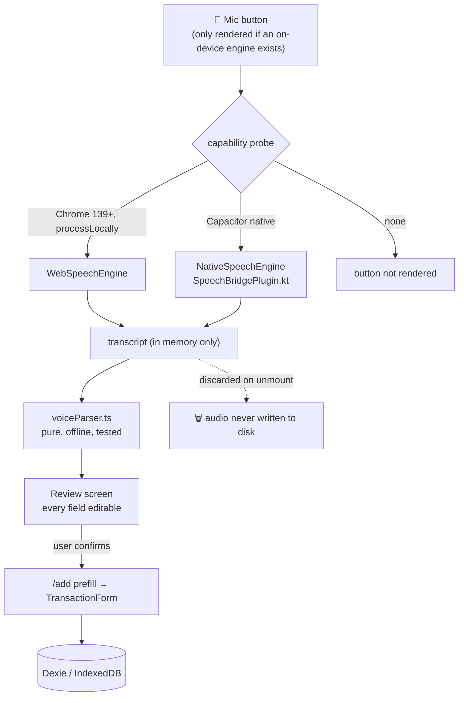

# Epic V — Voice input (English + Hindi)

> **Status:** design, not started. Written 2026-08-27.
> Companion docs: `PROJECT_ROADMAP.md` (living tracker), `ARCHITECTURE.md`, `playstore/DATA_SAFETY.md`.

**Goal.** Tap a mic, say *"spent 450 rupees on groceries from HDFC card"* or
*"HDFC card se 450 rupaye grocery mein kharch kiye"*, and get a pre-filled transaction to
review and save.

**Hard constraint.** MoneyIQ's Play Data Safety declares that financial parsing happens
**on-device** and nothing raw is uploaded. Voice must not weaken that claim. Everything
below follows from that one requirement.

---

## 1. What the user says maps onto what we already store

`Transaction` already has a field for every part of the sentence, so voice needs **no
schema change**:

| Spoken | Field | Notes |
|---|---|---|
| "spent **450** rupees" | `amount` | |
| "on **groceries**" | `categoryId` | matched against the user's own categories |
| "from **HDFC**" | `accountId` | matched against the user's own accounts |
| "**card**" / "UPI" / "cash" | `paymentMethod` | `upi │ cash │ card │ net_banking │ cheque │ auto_debit │ other` |
| "**yesterday**" / "kal" | `date` | |
| "at **Big Bazaar**" | `notes` | leftover text becomes the note |
| "**spent** / received" | `type` | `expense │ income │ transfer` |

---

## 2. Where the audio is processed — the decision that drives everything

This is the whole design problem. Same JavaScript, three very different platforms.

| Target | Speech engine | On-device? | Verdict |
|---|---|---|---|
| **Web PWA** (Chrome 139+) | Web Speech API with `processLocally = true` | **Yes**, enforced by spec | ✅ ship |
| **Web PWA** (older Chrome, Safari, Firefox) | Web Speech API, cloud | **No** — audio streams to the vendor | ❌ do not enable |
| **Android** (Capacitor WebView) | Web Speech API | n/a — unreliable in WebView | ❌ do not use |
| **Android** (Capacitor native) | `SpeechRecognizer.createOnDeviceSpeechRecognizer()` | **Yes**, enforced by the API | ✅ ship (custom plugin) |
| **Android** (Capacitor native, default) | `SpeechRecognizer.createSpeechRecognizer()` | **No** — Google's cloud | ❌ **would break Data Safety** |
| **iOS** (future) | `SFSpeechRecognizer` + `requiresOnDeviceRecognition` | **Yes**, when the locale supports it | ⏳ when the iOS shell exists |

### Verified facts behind that table

- **`processLocally` shipped in Chrome 139.** From MDN browser-compat-data
  (`api/SpeechRecognition.json`): `processLocally`, `available_static` and `install_static`
  are all `chrome: 139`, `safari: false`, and still flagged `experimental: true`.
  Per spec, `processLocally = true` *"indicates a requirement that the speech recognition
  process MUST be performed locally on the user's device"* — a requirement, not a hint.
  `SpeechRecognition.available({ langs, processLocally: true })` returns
  `unavailable │ downloadable │ downloading │ available`, and `install()` fetches the pack.
- **Classic `webkitSpeechRecognition` in Chrome streams audio to Google.** The Web Speech
  spec is explicit that it is agnostic between *"server-based and client-based/embedded"*
  recognition, and Chrome's implementation is server-based. **Safari's routing is not
  publicly documented — assume server-side.**
- **⚠️ BCD reports `webview_android: "mirror"` for these entries.** In browser-compat-data,
  `"mirror"` means *"no data — assume the same as the parent browser"*, i.e. it is an
  inferred default, **not a tested claim**. Android System WebView has historically
  exposed the constructor while recognition fails at runtime. **Treat WebView support as
  unproven and prove it empirically** (task V.2.0) rather than trusting the table.
- **Android on-device.** `SpeechRecognizer.isOnDeviceRecognitionAvailable(ctx)` +
  `createOnDeviceSpeechRecognizer(ctx)` (Android 13 / API 33). `checkRecognitionSupport()`
  reports installed vs. downloadable languages; `triggerModelDownload()` fetches one;
  `ERROR_LANGUAGE_UNAVAILABLE` (13) means *supported but not yet downloaded*, distinct from
  `ERROR_LANGUAGE_NOT_SUPPORTED` (12). The older `EXTRA_PREFER_OFFLINE` is **only a hint** —
  the docs say *"these values may have no effect"* — so it is **not** sufficient for our claim.

### Why not `@capacitor-community/speech-recognition`

Checked on npm directly: latest is **7.0.1**, peer `@capacitor/core: ">=7.0.0"`. We are on
`@capacitor/core ^8.4.2`, so it *does* install — the range is satisfied — but it was built
and tested against Capacitor 7 and there is no v8 release.

That is the smaller problem. The blocking one:

1. It calls `createSpeechRecognizer()` (**cloud**). There is no option to force on-device.
   Shipping it as-is would silently make our Data Safety declaration false.
2. It exposes only a single `language` string — no `EXTRA_ENABLE_LANGUAGE_SWITCH`, which is
   what makes Hinglish work.
3. Its `getSupportedLanguages()` is documented as not working on Android 13+ — exactly the
   range where on-device recognition exists.

**We already write custom Capacitor plugins in Kotlin.** `android-templates/` contains
`NotificationBridgePlugin.kt` and `WidgetBridgePlugin.kt`, both registered in
`MainActivity.kt` and both guarded by `scripts/verify-android-native.mjs`. A third,
`SpeechBridgePlugin.kt`, is the *established* pattern here — and it inherits that guard,
which is what protects us from the v79-class landmine where Kotlin silently never compiled.

---

## 3. Architecture



### New files

| File | Purpose |
|---|---|
| `src/shared/services/voice/types.ts` | `SpeechEngine` interface, `ParsedVoiceEntry` |
| `src/shared/services/voice/webSpeechEngine.ts` | Chrome 139+ `processLocally` path |
| `src/shared/services/voice/nativeSpeechEngine.ts` | Capacitor bridge to the Kotlin plugin |
| `src/shared/services/voice/engine.ts` | capability probe → picks an engine or `null` |
| `src/shared/services/voice/voiceParser.ts` | **pure** transcript → `ParsedVoiceEntry` |
| `src/shared/services/voice/hindiNumbers.ts` | Devanagari + romanized number words |
| `src/features/transactions/components/VoiceCapture.tsx` | mic UI, live transcript, disclosure |
| `src/features/transactions/components/VoiceReview.tsx` | confirm/edit before save |
| `android-templates/speech/SpeechBridgePlugin.kt` | on-device recognizer, language switch |
| `src/test/voiceParser.test.ts` | the bulk of the testing |
| `src/test/voiceEngine.test.ts` | capability gating + privacy invariants |

### Touched (all additive)

| File | Change | Risk |
|---|---|---|
| `AddTransactionPage.tsx` | accept `category` + `account` prefill params | additive — unknown params already ignored |
| `TransactionForm.tsx` | two new optional props | additive |
| `android-templates/widget/MainActivity.kt` | one `registerPlugin(...)` line | additive |
| `scripts/patch-android-manifest.mjs` | `RECORD_AUDIO` + `<queries>` | additive |
| `scripts/verify-android-native.mjs` | add the new class to `REQUIRED` | strengthens the guard |
| `playstore/DATA_SAFETY.md`, `playstore/PRIVACY_POLICY.md`, `public/privacy-policy.html`, `public/privacy.html` | disclose the mic | docs |

**No CSP change needed** — microphone access is not governed by CSP, and `index.html` sets
no `Permissions-Policy`, so nothing is blocking `getUserMedia`. (Checked, because a CSP gap
is exactly what silently broke receipt OCR in #32.)

---

## 4. The parser

Pure function, no I/O, no network — so it is fully unit-testable without a microphone:

```ts
parseVoiceEntry(transcript: string, categories: Category[], accounts: Account[]): ParsedVoiceEntry
```

It takes the user's **own** categories and accounts, mirroring the existing
`parseQuery(query, categories, accounts)` in `aiAssistant.ts`.

```ts
interface ParsedVoiceEntry {
  transcript: string;                      // raw, shown for correction
  type?: 'income' | 'expense' | 'transfer';
  amount?: number;
  categoryId?: string;
  accountId?: string;
  paymentMethod?: PaymentMethod;
  date?: string;                           // ISO yyyy-mm-dd
  notes?: string;
  confidence: Partial<Record<Field, 'high' | 'low'>>;  // drives what the review screen highlights
  unmatched: string[];                     // words we could not place
}
```

**Every field is optional.** A partial parse is a success — the review screen fills the
gaps. The parser never guesses silently: anything it is unsure of comes back `'low'` and is
highlighted for the user.

### Extraction rules

| Part | Approach |
|---|---|
| **Amount** | digits first (`450`, `1,200`, `1.5k`); fall back to number words. `en-IN` usually returns numerals already. |
| **Hindi numbers** | lookup table, Devanagari **and** romanized: `पचास/pachaas` 50, `सौ/sau` 100, `हज़ार/hazaar` 1000, `लाख/lakh` 100000. Compounds: "saade teen sau" → 350. |
| **Type** | spent/paid/kharch/diya → expense; received/got/mila/aaya → income; transfer/bheja → transfer. Default expense. |
| **Category** | exact → prefix → synonym table (`sabzi`/`kirana`/`grocery` → Groceries). Never invents a category. |
| **Account** | fuzzy match on the user's account names; "HDFC card" prefers a card account named HDFC. |
| **Payment mode** | gpay/phonepe/paytm/upi → `upi`; nakad/cash → `cash`; card → `card`; netbanking → `net_banking`. |
| **Date** | today/aaj, yesterday, parso, "3 tarikh", weekday names. |

> **⚠️ "kal" means both yesterday and tomorrow.** For an expense (past tense) it resolves to
> **yesterday**; the review screen always shows the resolved date so a wrong guess is
> visible and one tap to fix. Do not resolve it silently.

### Locale strategy for Hinglish

There is **no** mixed `hi-IN`+`en-IN` locale. On Android the native plugin can pass
`EXTRA_ENABLE_LANGUAGE_SWITCH` with `["hi-IN", "en-IN"]`, so the engine starts in Hindi and
switches mid-sentence — the main reason to own the plugin. On web, no such control exists,
so the user picks a language and we remember it.

`en-IN` tends to return numerals (`450`) and handles code-mixing better; `hi-IN` is more
accurate for full Hindi sentences. **Default `en-IN`**, with a toggle.

---

## 5. Privacy and security

**Invariants — these are the feature's contract:**

1. **Raw audio is never written to disk, IndexedDB, or the cloud backup.** Transcribe, parse,
   discard. Industry standard for finance apps, and it keeps us out of scope for the harder
   parts of GDPR/DPDP.
2. **No cloud speech engine, ever, in v1.** If no on-device engine exists, the mic button is
   **not rendered**. No silent cloud fallback — that is precisely how a truthful Data Safety
   declaration becomes false.
3. **The transcript lives in React state only** and is cleared on unmount and after save.
4. **The parser makes no network calls** and takes no callbacks that could.
5. **Mic permission is requested only on the first tap of the mic button**, never at launch.

**Why this keeps the declarations simple:**

- **Play Data Safety.** "Collection" means transmitting data off the device. Audio never
  leaves, so **"Audio: not collected"** stays truthful. The Data Safety FAQ also confirms
  that a user-controlled backup to *their own* Drive/OneDrive is not third-party sharing.
- **Play permissions policy.** `RECORD_AUDIO` is a Dangerous permission but **needs no
  special declaration form** (unlike SMS/Call Log/Location). It does require **prominent
  in-app disclosure before the system prompt**, and a working alternative if denied — we
  have one: typing.
- **Apple.** Both `NSMicrophoneUsageDescription` **and** `NSSpeechRecognitionUsageDescription`
  are required; missing either **crashes** the app on first use and fails Guideline 5.1.1.
  With `requiresOnDeviceRecognition = true` and no storage, **"Audio Data" need not be
  declared** in the privacy label.
- **Biometric?** No. Under GDPR Art. 9 voice is biometric only when processed *"for the
  purpose of uniquely identifying a natural person."* Speech-to-text for data entry is not
  identification. Apple's framework agrees. (India's DPDP rules were still not fully
  notified as of writing — flagged, not assumed.)

### Prominent disclosure (shown before the first permission prompt)

> **Voice entry uses your microphone.**
> Your speech is converted to text **on your device**. The recording is never saved and
> never leaves your phone. You can always type instead.

---

## 6. Phases

Each phase is independently shippable and independently revertable.

### V.0 — Parser only *(no UI, no permissions, no native code)*
`voiceParser.ts` + `hindiNumbers.ts` + tests. **Zero runtime risk** — nothing imports it yet.
Lets us prove Hindi/Hinglish handling against a corpus of ~60 sample utterances before
touching a microphone.
*Done when:* `npx vitest run` green, parser handles the corpus.

### V.1 — Web PWA voice *(on-device Chrome only)*
Engine interface + capability probe + `VoiceCapture` + `VoiceReview`; extend `/add` prefill
with `category`/`account`.
**Android is untouched** — the probe returns "unavailable" in the WebView, so the button
does not render. Web users on Chrome 139+ get the feature; everyone else sees no change.
*Done when:* works in Chrome 139+, invisible everywhere else, `tsc -b` + lint + tests green.

### V.2 — Android native on-device
`SpeechBridgePlugin.kt`, `RECORD_AUDIO` + `<queries>` in the manifest patch, the new class
added to `verify-android-native.mjs`, disclosure UI, language-pack download prompt, and the
four compliance docs.
- **V.2.0 first:** a throwaway spike that proves whether `webkitSpeechRecognition` actually
  works in our WebView. BCD says "mirror" (untested); we need the real answer before
  writing the plugin, because it decides whether the plugin is required or merely better.
*Done when:* the guard passes on a real AAB, and voice works offline in aeroplane mode —
which is the *proof* that recognition is on-device, not a claim.

### V.3 — Hinglish robustness
`EXTRA_ENABLE_LANGUAGE_SWITCH` across `hi-IN`/`en-IN`, `checkRecognitionSupport()` before
first use, `triggerModelDownload()` with a clear prompt, graceful `ERROR_LANGUAGE_UNAVAILABLE`.

### V.4 — iOS *(blocked: no iOS shell yet)*
`SFSpeechRecognizer`, `supportsOnDeviceRecognition` guard, both purpose strings.

---

## 7. How we guarantee nothing existing breaks

| Risk | Control |
|---|---|
| Add-transaction flow regresses | Voice **reuses** the existing `/add?...` prefill contract already used by receipt scan, share intents, the widget and shortcuts. New params are additive; unknown params are already ignored. |
| Voice UI appears where it cannot work | The mic button renders **only** if the probe returns an engine. Default is off. |
| Android build breaks | New Kotlin class is added to `verify-android-native.mjs` `REQUIRED`, so a silently-missing class **fails the build** instead of shipping dead. |
| Permission scares users / Play rejects | Disclosure before the prompt; typing always works; `RECORD_AUDIO` needs no special form. |
| Data Safety becomes false | No cloud engine is reachable in the build. Offline-mode test is the proof. |
| Parser misreads a number | Review screen is **mandatory**; nothing auto-saves; low-confidence fields are highlighted. |
| Bundle grows | Parser is small and pure; voice components are lazy-loaded like every other route. |

**Gates before each merge:** `tsc -b` · `npm run lint` · `npx vitest run` · `npm run build:capacitor`,
plus the native guard on any Android change.

---

## 8. Open questions for review

1. **Web PWA scope.** Chrome 139+ only, or wait and ship voice as Android-first? Chrome-only
   means many web users never see the button.
2. **If on-device Hindi is unavailable on a device** — hide voice, or offer English-only?
3. **Default language** — `en-IN` (better code-mixing, returns numerals) vs `hi-IN`.
4. **Entry point** — mic on the Quick-add screen, on the dashboard FAB, or both?
5. **Scope of v1** — expenses only, or income and transfers too?
